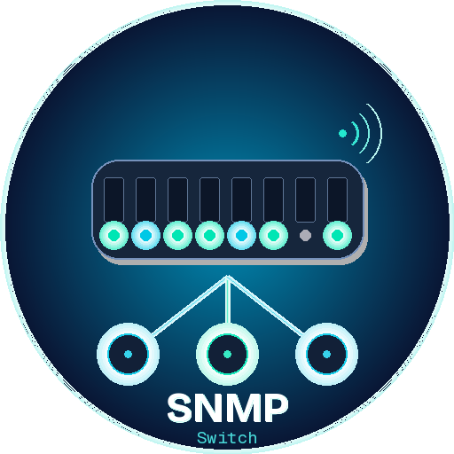

# HA-SNMP-Network-Switch

**Home Assistant Integration for managed network switches via SNMP**  
Monitor port status, traffic & errors — toggle ports — edit switch settings — directly from Home Assistant.

[](https://github.com/hacs/integration)
[](https://github.com/git4sim/HA-SNMP-Network-Switch/releases)
[](https://home-assistant.io)
[](https://python.org)
[](https://github.com/git4sim/HA-SNMP-Network-Switch/blob/main/LICENSE)
[](https://x.com/karpathy/status/1886192184808149383)

---

> [!NOTE]
> This integration supports **SNMP v1, v2c and v3** (noAuthNoPriv / authNoPriv / authPriv).
> Read-only access is enough for monitoring. A write community or SNMPv3 write user enables port toggling and SET services.
> Requires **Home Assistant 2025.1+** and **Python 3.12+** (pysnmp ≥ 7.0.0).

> [!TIP]
> 🤖 This integration was **vibecoded** — generated with AI assistance ([Claude by Anthropic](https://anthropic.com)) and iteratively refined. It is a community project.

---

## Features

- 📊 **System sensors** — sysDescr, sysUpTime, sysContact, sysName, sysLocation, port count
- 🔌 **Per-port sensors** — operational status, RX/TX traffic (64-bit HC counters), error counters
- 🔘 **Port switches** — enable/disable individual ports via `ifAdminStatus` SET
- 🔁 **Refresh button** — trigger an immediate SNMP poll
- ⚙️ **Services** — `set_port_alias`, `set_sys_contact`, `set_sys_location`, `set_sys_name`
- 🔐 **Full SNMPv3 USM** — MD5 / SHA / SHA-256 / SHA-512 auth · DES / AES-128 / AES-256 privacy
- 🛠️ **Config Flow** — multi-step UI setup, **no YAML required**
- 📦 **HACS compatible**

---

## Installation via HACS

Adding HA-SNMP-Network-Switch to Home Assistant can be done via HACS using this button:

[](https://my.home-assistant.io/redirect/hacs_repository/?owner=git4sim&repository=HA-SNMP-Network-Switch&category=integration)

> [!NOTE]
> If the button above doesn't work, add `https://github.com/git4sim/HA-SNMP-Network-Switch` manually as a Custom Repository of type **Integration** in HACS, then search for **SNMP Network Switch** and click Download.

After downloading, restart Home Assistant.

### Manual Installation

Copy the `custom_components/snmp_switch/` folder from the [latest release](https://github.com/git4sim/HA-SNMP-Network-Switch/releases/latest) into your HA config directory:

```
/config/custom_components/snmp_switch/
```

Restart Home Assistant.

---

## Configuration

Adding SNMP Network Switch to your Home Assistant instance can be done via the UI using this button:

[](https://my.home-assistant.io/redirect/config_flow_start?domain=snmp_switch)

> [!NOTE]
> If the button above doesn't work, go to **Settings → Devices & Services → Add Integration** and search for **SNMP Network Switch**.

The setup is a **multi-step wizard**:

**Step 1 — Connection**
 
| Field | Default | Description |
|---|---|---|
| IP Address / Hostname | — | Switch IP or DNS name |
| SNMP Port | `161` | UDP port |
| SNMP Version | `2c` | v1, v2c or v3 |
| Device name | *(sysName)* | Display name in HA |
| Poll interval | `30` | Seconds between polls (10–3600) |

**Step 2a — v1/v2c Community Strings**

| Field | Description |
|---|---|
| Community (Read) | Read-only community string |
| Community (Write) | Optional — enables port switches & SET services |

**Step 2b — SNMPv3 USM Credentials**

| Field | Description |
|---|---|
| Username | USM security name |
| Auth Protocol | none / MD5 / SHA / SHA-256 / SHA-512 |
| Auth Passphrase | Required for authNoPriv and authPriv (min. 8 chars) |
| Privacy Protocol | none / DES / 3DES / AES-128 / AES-256 |
| Privacy Passphrase | Required for authPriv (min. 8 chars) |
| Context Name | Optional — only for multi-context deployments |

---

## SNMPv3 Security Levels

| Security Level | Auth | Privacy | Use case |
|---|---|---|---|
| **noAuthNoPriv** | ✗ | ✗ | Testing only, not recommended |
| **authNoPriv** | ✅ | ✗ | Authenticated, traffic readable |
| **authPriv** | ✅ | ✅ | Fully encrypted — recommended for production |

> [!WARNING]
> Privacy (encryption) always requires authentication. Configuring privacy without auth will be rejected during setup.

---

## Switch Configuration Examples

### Cisco IOS / IOS-XE

```
! v2c
snmp-server community public RO
snmp-server community private RW

! v3 authPriv
snmp-server group HAGROUP v3 priv
snmp-server user hauser HAGROUP v3 auth sha MyAuthPass priv aes 128 MyPrivPass
snmp-server view HAVIEW internet included
```

### HPE ProCurve / Aruba

```
snmp-server community "public" operator unrestricted
snmp-server community "private" manager unrestricted
```

### Ubiquiti UniFi

**Controller → Settings → System → SNMP** — enable SNMP, set community string.

### TP-Link TL-SG Series

**Admin UI → SNMP → Community Config → Add**  
`public` (Read-Only) and `private` (Read-Write)

### MikroTik RouterOS

```
/snmp set enabled=yes
/snmp community add name=public read-access=yes write-access=no
/snmp community add name=private read-access=yes write-access=yes
```

---

## Entities

For each configured switch:

| Entity | Description |
|---|---|
| `sensor.*_beschreibung` | sysDescr — device description |
| `sensor.*_uptime` | sysUpTime in seconds + human-readable attribute |
| `sensor.*_kontakt` | sysContact |
| `sensor.*_systemname` | sysName |
| `sensor.*_standort` | sysLocation |
| `sensor.*_anzahl_ports` | Port count + ports_up / ports_down attributes |
| `sensor.*_portX_status` | ifOperStatus per port |
| `sensor.*_portX_rx` | ifHCInOctets (64-bit) |
| `sensor.*_portX_tx` | ifHCOutOctets (64-bit) |
| `sensor.*_portX_fehler` | in_errors + out_errors |
| `switch.*_portX` | ifAdminStatus toggle *(write access required)* |
| `button.*_aktualisieren` | Trigger immediate poll |

---

## Services

### `snmp_switch.set_port_alias`

Set the ifAlias (port description) on a port.

```yaml
service: snmp_switch.set_port_alias
data:
  entry_id: "abc123"   # Settings → Devices & Services → Integration → Entry ID
  if_index: 5
  alias: "NAS Server"
```

### `snmp_switch.set_sys_contact`

```yaml
service: snmp_switch.set_sys_contact
data:
  entry_id: "abc123"
  contact: "IT Admin <admin@company.com>"
```

### `snmp_switch.set_sys_location`

```yaml
service: snmp_switch.set_sys_location
data:
  entry_id: "abc123"
  location: "Server Room - Rack 3"
```

### `snmp_switch.set_sys_name`

```yaml
service: snmp_switch.set_sys_name
data:
  entry_id: "abc123"
  name: "office-switch-01"
```

---

## Automation Examples

### Disable port at night

```yaml
automation:
  - alias: "Guest port off at night"
    trigger:
      - platform: time
        at: "23:30:00"
    action:
      - service: switch.turn_off
        target:
          entity_id: switch.officeswitch_ge0_8
```

### Alert on port errors

```yaml
automation:
  - alias: "Switch port error alert"
    trigger:
      - platform: numeric_state
        entity_id: sensor.officeswitch_ge0_1_fehler
        above: 50
    action:
      - service: notify.mobile_app
        data:
          title: "⚠️ Switch Error"
          message: "Port 1 has over 50 errors!"
```

---

## Debug Logging

To enable debug logging, add this to your `configuration.yaml`:

```yaml
logger:
  default: info
  logs:
    custom_components.snmp_switch: debug
```

Or enable it via **Settings → Devices & Services → SNMP Network Switch → Enable Debug Logging**.

### Connection test (Linux / macOS)

```bash
# v2c
snmpwalk -v2c -c public 192.168.1.1 1.3.6.1.2.1.1.1.0

# v3 authPriv
snmpwalk -v3 -u hauser -l authPriv -a SHA -A MyAuthPass -x AES -X MyPrivPass 192.168.1.1 1.3.6.1.2.1.1.1.0
```

| Problem | Solution |
|---|---|
| *Cannot connect* | Check firewall (UDP 161), SNMP enabled on switch? |
| *Invalid auth* | Check community string case / USM credentials |
| *Switch entities missing* | Write community or SNMPv3 write user configured? |
| *No port sensors* | Test ifTable access with `snmpwalk` |
| *v3 auth error* | Auth passphrase must be ≥8 characters |
| *v3 priv error* | Privacy requires auth — both must be configured |

---

## 🤖 About Vibecoding

This integration was built with **AI pair-programming** ([Claude by Anthropic](https://anthropic.com)) rather than written fully by hand. Architecture, SNMPv3 auth/priv handling, all HA platforms and the HACS packaging were generated iteratively with AI help.

This means:

- It works, but **edge cases may exist**
- PRs, bug reports, and improvements are very welcome!

---

## Legal

- Released under the **[MIT License](LICENSE)**
- Not affiliated with any switch vendor
- Use in compliance with your device's terms of service

---

Made with 🌐 + 🤖 + ☕ | [Report a Bug](https://github.com/git4sim/HA-SNMP-Network-Switch/issues)
